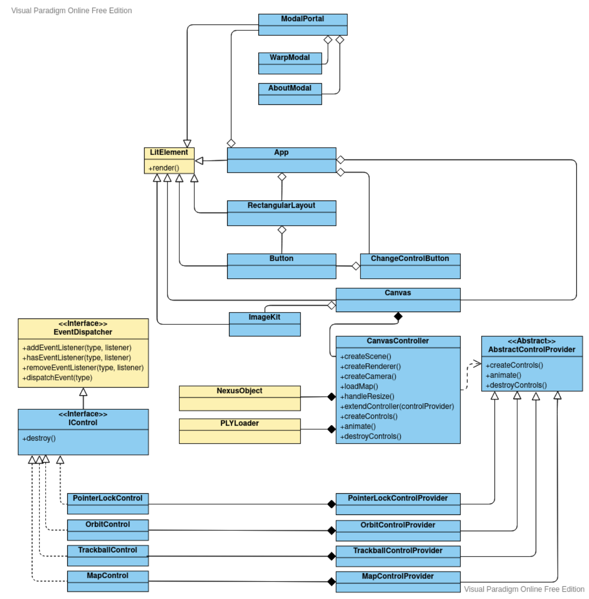

# Rodones Map Viewer

Rodones Map Viewer is a polygon mesh map viwer with support of different controls. The software is built using [threejs](https://threejs.org/), [nexus](https://github.com/cnr-isti-vclab/nexus), [lit](https://lit.dev).

## Development 
### Requirements

- [NodeJS](https://nodejs.org/en/)
- [Yarn](https://yarnpkg.com/)

### Setup

- Clone the repository: `git clone https://github.com/rodones/map`
- Enter the repository folder: `cd map`
- Install dependencies: `yarn install`
- Start development server: `yarn start`

### Scripts

- `yarn start`: starts webpack development server.
- `yarn build`: creates development build.
- `yarn build:prod`: creates production build.
- `yarn clean`: cleans build folder.
- `yarn lint`: lints project using eslint.

## Architecture

## License

Copyright (c) 2021, Rodones Mapping Project. See [LICENSE](LICENSE) file.